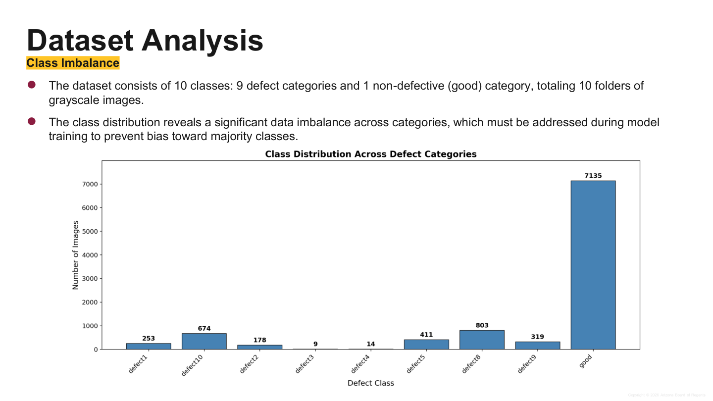
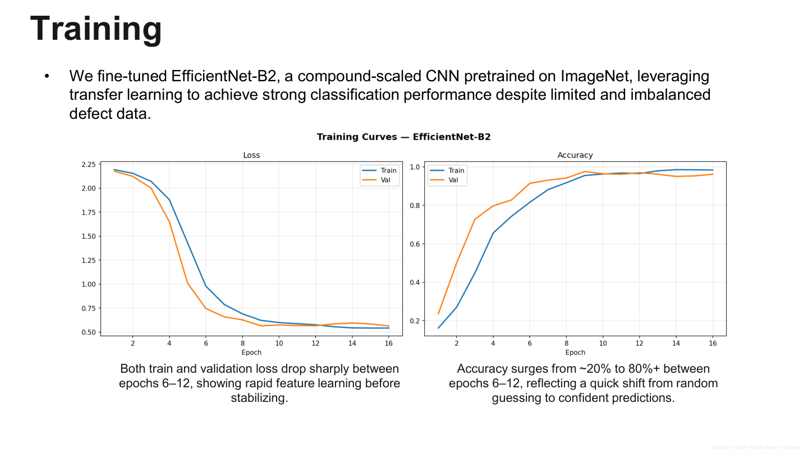
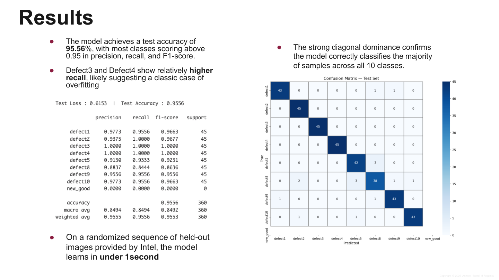
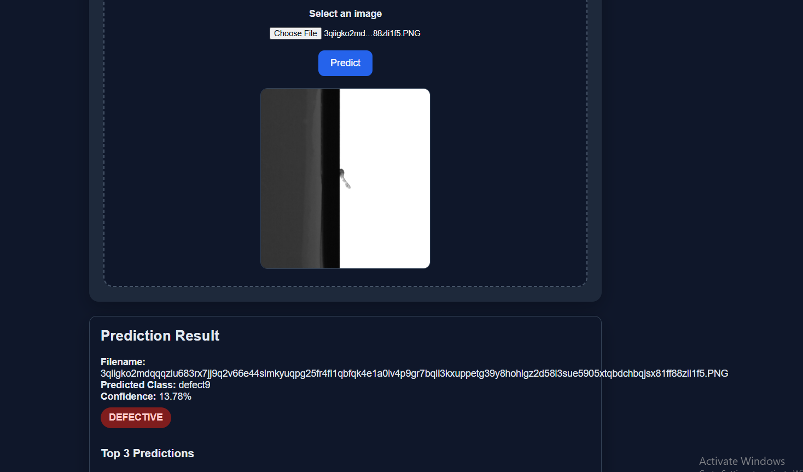
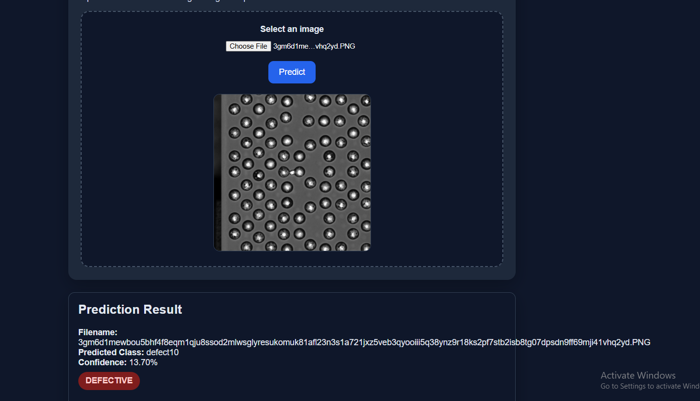

# Intel Semiconductor Defect Classification System

AI-powered semiconductor defect classification platform built with **PyTorch**, **EfficientNet-B2**, and **FastAPI** for real-time inference on semiconductor imagery.

Developed for the **Intel Semiconductor Solutions Challenge 2026**.


---

## Overview

This project solves a **small-sample defect classification** problem in semiconductor manufacturing. The system classifies grayscale semiconductor images into defect categories or as non-defective, and exposes the trained model through a FastAPI web application with an interactive dashboard.

The project combines:

- deep learning-based image classification
- real-time API inference
- interactive browser-based prediction UI
- performance visualization with training curves and confusion matrices
- GPU acceleration with CUDA support
- modular backend structure for deployment

According to the project report, the system was designed for a low-data manufacturing setting where defect classification affects yield, product quality, and time-to-market. The report also notes that the challenge specifically targets learning from limited labeled data. 

---

## Key Highlights

- **Model:** EfficientNet-B2 fine-tuned with transfer learning
- **Framework:** PyTorch
- **Serving Layer:** FastAPI
- **Input Resolution:** 260 x 260
- **Classes:** 9 defect classes + 1 non-defective class
- **Test Accuracy:** **95.56%**
- **Best Validation Accuracy:** **97.50%**
- **Hardware Tested:** NVIDIA RTX 3060 with CUDA, plus CPU fallback

---

## Problem Context

In semiconductor manufacturing, defect classification directly impacts:

- yield
- product quality
- time-to-market

The report also highlights two core constraints of the dataset:

- real production environments have **limited labeled data**
- the raw class distribution is **heavily imbalanced**

These conditions make the task more challenging than standard image classification and justify the use of balancing strategies and transfer learning. 

---

## Dataset and Classes

The system predicts one of the following classes:

- defect1
- defect2
- defect3
- defect4
- defect5
- defect8
- defect9
- defect10
- new_good

> Note: the challenge presentation describes the dataset as **9 defect categories plus 1 good/non-defective category**.

### Dataset balancing strategy

The report states that:

- **defect3** and **defect4** had very few samples and were upsampled using augmentation
- the remaining classes were undersampled
- all classes were balanced to **300 samples each**

This balancing strategy was used to reduce bias toward majority classes and create a more uniform training distribution. 



---

## Model Details

- **Architecture:** EfficientNet-B2
- **Learning approach:** transfer learning from ImageNet-pretrained weights
- **Task:** multi-class semiconductor defect classification
- **Image type:** grayscale semiconductor imagery

The report notes that EfficientNet-B2 was selected and fine-tuned to achieve strong performance despite limited and imbalanced training data. 

---

## Performance

### Reported metrics

- **Test Accuracy:** 95.56%
- **Best Validation Accuracy:** 97.50%

The report further states that most classes achieved precision, recall, and F1-scores above 0.95, with strong diagonal dominance in the confusion matrix, indicating that the model correctly classifies most held-out samples. 





---

## Web Application Features

The FastAPI application provides:

- image upload for inference
- predicted class output
- confidence score display
- model health endpoint
- interactive dashboard experience
- visual model evaluation assets

### API endpoints

#### `GET /`
Returns the dashboard UI.

#### `POST /predict`
Uploads an image and returns classification output.

#### `GET /health`
Returns API health status and runtime information.

### Example response

```json
{
  "filename": "sample.png",
  "predicted_class": "defect8",
  "confidence": 0.94
}
```

---

## Project Structure

```text
backend/
├── app/
│   ├── main.py
│   ├── api/
│   │   └── model.py
│   ├── templates/
│   │   └── index.html
│   ├── assets/
│   │   ├── classification_report.txt
│   │   ├── confusion_matrix_test.png
│   │   ├── confusion_matrix_val.png
│   │   └── training_curves.png
│   └── models/
│       └── best_model.pth
├── requirements.txt
└── README.md
```

---

## Installation

### 1. Clone the repository

```bash
git clone <repository-url>
cd backend
```

### 2. Create a virtual environment

```bash
python -m venv venv
```

### 3. Activate the environment

**Windows**
```bash
venv\Scripts\activate
```

**macOS / Linux**
```bash
source venv/bin/activate
```

### 4. Install dependencies

```bash
pip install fastapi uvicorn torch torchvision pillow jinja2 python-multipart
```

---

## Run the Application

Start the FastAPI server:

```bash
uvicorn app.main:app --reload
```

Open:

- **Web UI:** `http://127.0.0.1:8000`
- **API docs:** `http://127.0.0.1:8000/docs`

---

## Dashboard and Evaluation Assets

Store generated training and evaluation visuals in:

```text
backend/app/assets/
```

Expected files:

- `classification_report.txt`
- `confusion_matrix_test.png`
- `confusion_matrix_val.png`
- `training_curves.png`

The screenshots below illustrate the dashboard-style prediction interface shown in the project report. fileciteturn0file0



---

## Deployment Options

This project can be deployed in multiple ways:

- local FastAPI server
- Docker container
- cloud VM deployment
- managed app hosting for public access

### Example Docker commands

```bash
docker build -t intel-defect-classifier .
docker run -p 8000:8000 intel-defect-classifier
```

### Public hosting ideas

- Render
- Azure App Service
- AWS EC2 / ECS
- Google Cloud Run

---

## Hardware Support

- **CUDA GPU acceleration**
- **CPU fallback**
- validated on **RTX 3060**

The report explicitly states that the system was tested on an RTX 3060 and supports GPU acceleration with CPU fallback. fileciteturn0file0

---

## Assumptions

Based on the report, the project assumes:

- the provided labels are accurate
- grayscale imagery is sufficient for classification
- augmentation does not distort core defect characteristics
- balancing all classes to equal sample counts improves learning stability

These assumptions are summarized in the challenge presentation. 

---

## Future Improvements

- batch image prediction
- model versioning
- real-time defect localization
- explainability overlays
- Docker-based deployment
- cloud inference pipeline
- monitoring and observability
- CI/CD integration

---

## License

Intended for academic, research, and portfolio use unless otherwise specified in the repository.

---

## Acknowledgment

Built for the **Intel Semiconductor Solutions Challenge 2026**. Performance numbers, dataset balancing details, and challenge context in this README were aligned with the uploaded project report. 
